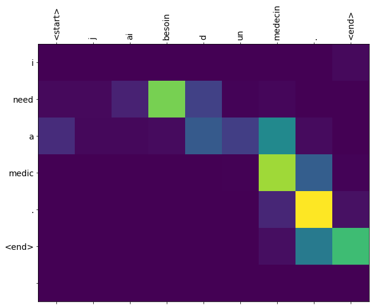
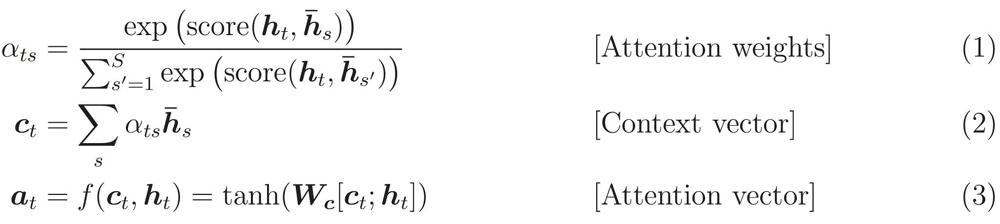

# Project: Encoder-Decoder Model with Attention for Neural Machine Translation

@author: Syed Shahzad Raza

<h1>Table of Contents</h1>

<ul class="toc-item"><li><a href="#Project-Statement" data-toc-modified-id="Project-Statement-1">1&nbsp;&nbsp;Project Statement</a><ul class="toc-item"><li><a href="#Project-Overview" data-toc-modified-id="Project-Overview-1.1">1.1&nbsp;&nbsp;Project Overview</a></li><li><a href="#Use-Case" data-toc-modified-id="Use-Case-1.2">1.2&nbsp;&nbsp;Use Case</a></li><li><a href="#Data-Acquisition" data-toc-modified-id="Data-Acquisition-1.3">1.3&nbsp;&nbsp;Data Acquisition</a></li></ul></li><li><a href="#Technology-Choice" data-toc-modified-id="Technology-Choice-2">2&nbsp;&nbsp;Technology Choice</a></li><li><a href="#Model-Definition" data-toc-modified-id="Model-Definition-3">3&nbsp;&nbsp;Model Definition</a></li><li><a href="#References" data-toc-modified-id="References-4">4&nbsp;&nbsp;References</a></li></ul>

## Project Statement
The objective of this project is to train a seq2seq model (an encoder-decoder model with attention) for machine translation.

### Project Overview

**Keywords:** 
* Natural Language Processing (NLP)
* Natural Language Understanding (NLU)
* Deep Learning
* Neural Networks
* Sequence to Sequence (seq2seq) model
* Neural Machine Translation
* Encoder-decoder model
* Machine translation with attention

We train a sequence to sequence (seq2seq) model for neural machine translation from French to English using TensorFlow. This is an advanced example that assumes knowledge of seq2seq models.

### Use Case

This project is motivated by the idea of implementing an advanced encoder-decoder model with attention to perform neural machine translation between two national languages of Canada. It serves as a decent advanced project to reproduce a "toy-example" to translate sentences from French to English.

The trained model can be used to input French sentences such as "Je savais que tu serais furieux." to return English translation "I knew you'd be mad."

Note that we have trained the model on only 30,000 sentences to save time. This degrades the quality of results but serves the purpose of presenting a good tutorial for machine translation.

### Data Acquisition

The language dataset is obtained from [http://www.manythings.org/anki/](http://www.manythings.org/anki/). The repository contains sentence translation pairs in the format:

`The bird spread its wings.	Cet oiseau déployait ses ailes.	CC-BY 2.0 (France) Attribution: tatoeba.org #45008 (CK) & #181257 (Romira)`

Since the file contains information not useful for machine translation, we have pre-processed the data using the following steps:

1. Splitting each line to only keep the sentence pairs
2. Adding start and end tokens to each sentence pair
3. Removing special characters from each sentence pair
4. Generating a word index and reverse word index to map from word → id and id → word
   
The repository offers tab-delimited bilingual sentence pairs for a variety of languages. These sentence pairs are from the [Tatoeba Project](http://tatoeba.org/home). 

## Technology Choice
* Python
* TensorFlow
* Google Cloud Platform (GCP)

## Model Definition
This notebook implements an encoder-decoder model with attention as described [here](https://github.com/tensorflow/nmt#background-on-the-attention-mechanism). 

Here is a diagram showing an attention-based NMT system as described in [Luong's paper](https://arxiv.org/abs/1508.04025v5). The attention computation happens at every decoder time step. 

It consists of the following stages:

1. The current target hidden state is compared with all source states to derive attention weights as shown in the attention visualization below.

2. Based on the attention weights we compute a context vector as the weighted average of the source states.
3. Combine the context vector with the current target hidden state to yield the final attention vector
4. The attention vector is fed as an input to the next time step (input feeding). The first three steps can be summarized by the equations below:

The `score` function is used to compare target hidden state $h_t$ with each of the source hidden states $\overline{h}_s$, and the result is normalized to produce attention weights (a distribution over source positions).

There are various choices of the scoring function; popular scoring functions include the multiplicative and additive forms.

Various implementations of attention mechanisms can be found in [attention_wrapper.py](https://github.com/tensorflow/tensorflow/blob/master/tensorflow/contrib/seq2seq/python/ops/attention_wrapper.py).

This tutorial uses [Bahdanau attention](https://arxiv.org/pdf/1409.0473.pdf) for the encoder.

**What matters in the attention mechanism?**

As hinted in the above equations, there are many different attention variants. These variants depend on the form of the scoring function and the attention function, and on whether the previous state $h_{t-1}$ is used instead of $h_t$ in the scoring function as originally suggested in (Bahdanau et al., 2015). Empirically, we found that only certain choices matter. First, the basic form of attention, i.e., direct connections between target and source, needs to be present. Second, it's important to feed the attention vector to the next timestep to inform the network about past attention decisions as demonstrated in (Luong et al., 2015). Lastly, choices of the scoring function can often result in different performance. See more in the [benchmark results](https://github.com/tensorflow/nmt#benchmarks) section.

## References

* Dzmitry Bahdanau, Kyunghyun Cho, and Yoshua Bengio. 2015. [Neural machine translation by jointly learning to align and translate](https://arxiv.org/pdf/1409.0473.pdf). ICLR.
* Minh-Thang Luong, Hieu Pham, and Christopher D Manning. 2015. [Effective approaches to attention-based neural machine translation](https://arxiv.org/pdf/1508.04025.pdf). EMNLP.
* Ilya Sutskever, Oriol Vinyals, and Quoc V. Le. 2014. [Sequence to sequence learning with neural networks](https://papers.nips.cc/paper/5346-sequence-to-sequence-learning-with-neural-networks.pdf). NIPS.
